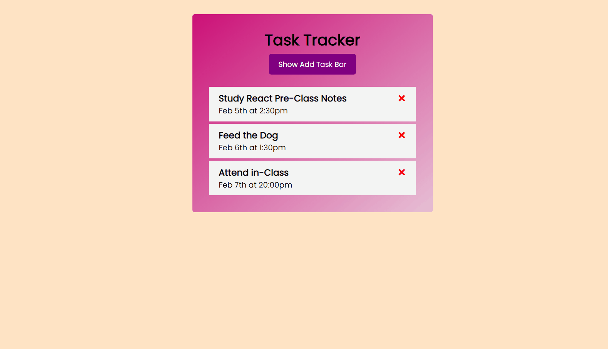

# Task Tracker


## Project Skeleton

```
Task Tracker (folder)
|
|----readme.md   
|
├── public
│     └── index.html
├── src
│    ├── components
│    │       ├── Header.js
│    │       │     └── Button.js
│    │       │   
│    │       ├── CreateTask.js
│    │       │   
│    │       │   
│    │       └── TaskList.js
│    │             └── TaskItem.js
│    │            
│    ├── App.js
│    ├── App.css
│    ├── index.js
│    └── index.css
├── package.json
└── yarn.lock
```

## Expected Outcome




## Contact

- GitHub [@iycel](https://github.com/iycel)

- Linkedin [@iycel](https://linkedin.com/in/iycel)
